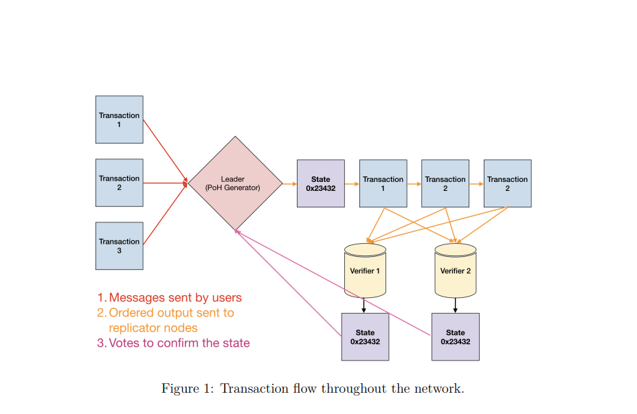

# solana Research 

### 1. solana network framework

leader is to generate a poh sequence, and caculate the final state with signature and send to verifiers. Verifiers execute the same transactions on their copies of the state to reply to leader as confirmations. This is votes.  

// something_need_to_think 
// 1. 转发的是什么，3笔交易和state？  
// 2. leader election 过程和verifier 选举？ 通过pos?   
// 3. quorum 多少？ 2f+1?3f+1
   基于不同的容错模型来commit，bft则是3f+1
// 4. 什么时候换主，如何保持活性？pos的任期？ 
    基于pos的选主term
// 5. 一笔带state的交易集是否打包为一个block，merkle tree也是这样在账本里，是否冗余？
    不需要考虑，共识内存态只关心校验和出块，不像raft需要保存完整数据   

### 2. how poh works

Proof of History is a sequence of computation that can provide a way to cryptographically verify passage of time between two events.

demo:  
demo中定义slot和timestamp为每一轮次的输入，通过caculate_hash计算hash 
poh用来根据上次hash_output&&当前输入hash迭代计算next_hash以此形成hash序列 
详见poh_demo

### 3. leader election
https://docs.solana.com/cluster/leader-rotation

